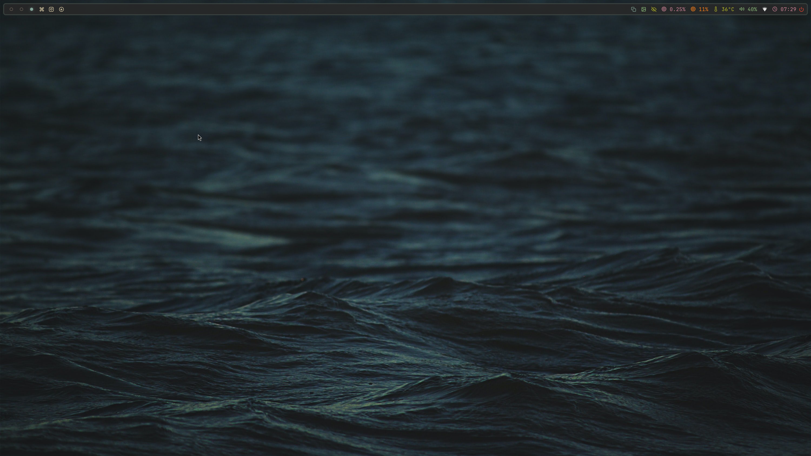
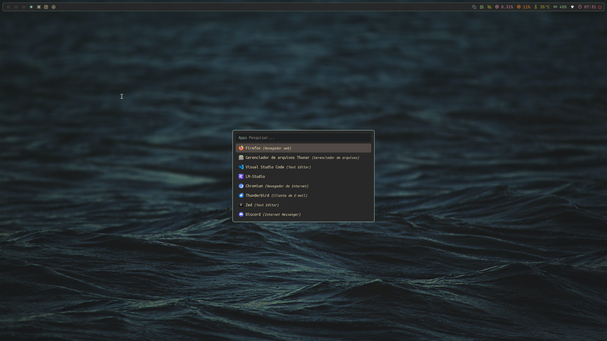
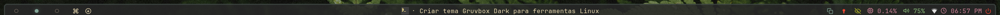

# Dotfiles

Meus arquivos de configuração pessoais (dotfiles) — shell, editor, SSH e
afins — versionados em Git para facilitar backup e replicação em novas
máquinas.

## Screenshots



## Sistema

- **Distro:** Arch Linux (rolling)
- **Kernel:** Linux 7.1.3-arch2-1
- **CPU:** Intel Core Ultra 9 285K
- **GPU:** Intel Graphics (Arrow Lake-S, iGPU) + NVIDIA GeForce RTX 5060 Ti
- **RAM:** 62 GiB
- **Sessão:** Wayland (sem DE — apenas WM + utilitários avulsos)
- **Compositor / WM:** [Mango](https://github.com/DreamMaoMao/mango) (dwm-like, tiling em Wayland), compilado a partir do código-fonte
- **Barra de status:** [Waybar](https://github.com/Alexays/Waybar)
- **Launcher:** [Rofi](https://github.com/davatorium/rofi) (`drun`, `rofi-pass`, toggle de apps próprio)
- **Notificações:** [Mako](https://github.com/emersion/mako)
- **Lockscreen:** [Swaylock](https://github.com/swaywm/swaylock)
- **Menu de logout:** [Wlogout](https://github.com/ArtsyMacaw/wlogout)
- **Terminais:** [Foot](https://codeberg.org/dnkl/foot) (principal) e [Kitty](https://sw.kovidgoyal.net/kitty/)
- **Shell:** Zsh + [tmux](https://github.com/tmux/tmux)
- **Editor:** [Neovim](https://neovim.io/) (config em Lua) + Vim (`.vimrc`, config mais simples pra quando nvim não tá disponível)
- **Gerenciador de arquivos:** [Thunar](https://docs.xfce.org/xfce/thunar/start), com Custom Actions próprias (`dotfile-track.sh` e outras)
- **Música:** [MPD](https://www.musicpd.org/) + [ncmpcpp](https://ncmpcpp.rocks/) (cliente TUI) + `ytmusic.sh` (baixa do YouTube/YouTube Music)
- **Vídeo:** [mpv](https://mpv.io/), com scripts próprios de download (`video-down.sh`) e compactação via GPU/NVENC (`video-shrink.sh`)
- **IRC:** [senpai](https://sr.ht/~taiite/senpai/), compilado a partir do código-fonte
- **Senhas:** [pass](https://www.passwordstore.org/) + `rofi-pass.sh` (menu no rofi) — cofre em repositório Git separado
- **Screenshot/gravação de tela:** `grim`/`slurp` via `screenshot-area.sh`/`screenshot-full.sh`, `wf-recorder` via `screen-recorder.sh`
- **Disco:** LUKS gerenciado por `luks.sh`
- **GTK 3/4:** tema [Colloid](https://github.com/vinceliuice/Colloid-gtk-theme) (variante Gruvbox, AUR `colloid-gruvbox-gtk-theme-git`) + ícones Papirus-Dark
- **Fontes:** Nerd Fonts (UbuntuMono Nerd Font Mono, JetBrainsMono Nerd Font, Monaspace, entre outras)
- **IA/commits:** `aicommit.sh` gera mensagens de commit usando um modelo local via [LM Studio](https://lmstudio.ai/) (`lms`, servidor OpenAI-compatible em `localhost:1234`)

### Screenshots

| | |
| --- | --- |
| Desktop (Waybar + Mango) |  |
| Rofi (`drun`) |  |
| Waybar (detalhe) |  |

## Symlinks

Tabela de todos os arquivos/pastas do `$HOME` que são symlinks apontando para dentro deste repositório, e o que já está "trackeado" aqui. Mantida automaticamente pelo script `dotfile-track.sh` (Thunar Custom Action) sempre que um novo item é movido para cá.

| Origem | Aponta para |
| --- | --- |
| `~/.config/mako` | `~/dotfiles/.config/mako` |
| `~/.config/swaylock` | `~/dotfiles/.config/swaylock` |
| `~/.config/rofi` | `~/dotfiles/.config/rofi` |
| `~/.local/share/ags-sysmenu` | `~/dotfiles/.local/share/ags-sysmenu` |
| `~/.config/Thunar/uca.xml` | `~/dotfiles/.config/Thunar/uca.xml` |
| `~/bin/rofi-app-toggle` | `~/dotfiles/bin/rofi-app-toggle` |
| `~/bin/luks.sh` | `~/dotfiles/bin/luks.sh` |
| `~/.config/foot/foot.ini` | `~/dotfiles/.config/foot/foot.ini` |
| `~/.config/gtk-3.0/settings.ini` | `~/dotfiles/.config/gtk-3.0/settings.ini` |
| `~/.config/gtk-4.0/settings.ini` | `~/dotfiles/.config/gtk-4.0/settings.ini` |
| `~/.config/kitty` | `~/dotfiles/.config/kitty` |
| `~/.config/mango` | `~/dotfiles/.config/mango` |
| `~/.config/mpd/mpd.conf` | `~/dotfiles/.config/mpd/mpd.conf` |
| `~/.config/mpv/input.conf` | `~/dotfiles/.config/mpv/input.conf` |
| `~/.config/mpv/mpv.conf` | `~/dotfiles/.config/mpv/mpv.conf` |
| `~/.config/ncmpcpp/bindings` | `~/dotfiles/.config/ncmpcpp/bindings` |
| `~/.config/ncmpcpp/config` | `~/dotfiles/.config/ncmpcpp/config` |
| `~/.config/nvim/init.lua` | `~/dotfiles/.config/nvim/init.lua` |
| `~/.config/nvim/lua` | `~/dotfiles/.config/nvim/lua` |
| `~/.config/senpai/senpai.scfg` | `~/dotfiles/.config/senpai/senpai.scfg` |
| `~/.config/waybar` | `~/dotfiles/.config/waybar` |
| `~/.config/wlogout` | `~/dotfiles/.config/wlogout` |
| `~/.local/bin/aicommit.sh` | `~/dotfiles/.local/bin/aicommit.sh` |
| `~/.local/bin/dotfile-track.sh` | `~/dotfiles/.local/bin/dotfile-track.sh` |
| `~/.local/bin/fscrypt-encrypt.sh` | `~/dotfiles/.local/bin/fscrypt-encrypt.sh` |
| `~/.local/bin/fscrypt-decrypt.sh` | `~/dotfiles/.local/bin/fscrypt-decrypt.sh` |
| `~/.local/bin/ram.sh` | `~/dotfiles/.local/bin/ram.sh` |
| `~/.local/bin/rofi-pass.sh` | `~/dotfiles/.local/bin/rofi-pass.sh` |
| `~/.local/bin/screen-recorder.sh` | `~/dotfiles/.local/bin/screen-recorder.sh` |
| `~/.local/bin/screenshot-area.sh` | `~/dotfiles/.local/bin/screenshot-area.sh` |
| `~/.local/bin/screenshot-full.sh` | `~/dotfiles/.local/bin/screenshot-full.sh` |
| `~/.local/bin/theme-switcher.sh` | `~/dotfiles/.local/bin/theme-switcher.sh` |
| `~/.local/bin/video-down.sh` | `~/dotfiles/.local/bin/video-down.sh` |
| `~/.local/bin/video-shrink.sh` | `~/dotfiles/.local/bin/video-shrink.sh` |
| `~/.local/bin/ytmusic.sh` | `~/dotfiles/.local/bin/ytmusic.sh` |
| `~/.npmrc` | `~/dotfiles/.npmrc` |
| `~/.pi/agent/models.json` | `~/dotfiles/.pi/agent/models.json` |
| `~/.ssh/config` | `~/dotfiles/.ssh/config` |
| `~/.tmux.conf` | `~/dotfiles/.tmux.conf` |
| `~/.vimrc` | `~/dotfiles/.vimrc` |
| `~/.zprofile` | `~/dotfiles/.zprofile` |
| `~/.zshrc` | `~/dotfiles/.zshrc` |

## Temas

Tema padrão atual: **Gruvbox Dark**. O tema anterior (**Tokyo Night**) foi
mantido em paralelo — nada foi apagado, só trocado o que cada app carrega
por padrão.

A troca é feita por um script único, o
[`theme-switcher.sh`](.local/bin/theme-switcher.sh), em vez de editar cada
app manualmente (veja a seção "Arquivos recentes" logo abaixo pros
detalhes).

| App | Padrão atual | Trocado por |
| --- | --- | --- |
| Mango | `.config/mango/themes/gruvbox-dark.conf` | `theme-switcher.sh` (edita o `source=` em `config.conf` e dá `mmsg dispatch reload_config`) |
| Waybar | `.config/waybar/style-gruvbox.css` | `theme-switcher.sh` (edita o `@import` em `style.css`; recarrega sozinho via `reload_style_on_change`) |
| Rofi | `.config/rofi/gruvbox-dark.rasi` | `theme-switcher.sh` (edita o `@theme` em `config.rasi`) |
| Mako | `.config/mako/config-gruvbox` (symlink `config` → `config-gruvbox`) | `theme-switcher.sh` (refaz o symlink e dá `makoctl reload`) |
| Foot | `.config/foot/themes/gruvbox-dark.ini` | `theme-switcher.sh` (edita o `include=` em `foot.ini`; só vale pra terminais novos) |
| Vim | plugin `morhetz/gruvbox` (`.vimrc`) | `theme-switcher.sh` (alterna os comentários de `airline_theme`/`colorscheme` no `.vimrc`) |
| Neovim | plugin `ellisonleao/gruvbox.nvim` (`.config/nvim/lua/plugins/gruvbox.lua`) | `theme-switcher.sh` (reescreve `gruvbox.lua`/`tokyo-night.lua` trocando `lazy`/`priority`/`vim.cmd.colorscheme`) |
| tmux | `~/.tmux/theme` (arquivo de estado, já existia via `toggle-theme.sh`) | `theme-switcher.sh` (escreve o mesmo arquivo de estado e dá `tmux source-file` se já tiver uma sessão aberta) |
| GTK 3/4 | tema `Colloid-Dark-Gruvbox` (AUR `colloid-gruvbox-gtk-theme-git`) | `theme-switcher.sh` tenta, mas não existe pacote Tokyo Night instalado — ao escolher Tokyo Night ele só avisa e mantém o Gruvbox |
| Kitty | `.config/kitty/themes/gruvbox-dark.conf` | não coberto pelo script — trocar manualmente |
| ags-sysmenu | `.local/share/ags-sysmenu/style-gruvbox.css` | não coberto pelo script — edite o `@import` em `style.css` pra `style-tokyonight.css` |

### Arquivos recentes: `theme-switcher.sh`

- **[`.local/bin/theme-switcher.sh`](.local/bin/theme-switcher.sh)** — alterna
  o tema (Gruvbox Dark ⇄ Tokyo Night) do foot, rofi, mango, waybar, mako,
  gtk, nvim, vim e tmux com um comando só, gravando o tema ativo em
  `~/.config/theme-switcher/current`. Subcomandos:
  - `theme-switcher.sh set <gruvbox-dark|tokyonight>` — aplica um tema específico
  - `theme-switcher.sh toggle` — alterna entre os dois
  - `theme-switcher.sh menu` — abre um menu no rofi pra escolher
  - `theme-switcher.sh current` — imprime o id do tema ativo
  - `theme-switcher.sh status` — imprime JSON pro custom module da waybar

  Depois de aplicar, ele dispara `mmsg dispatch reload_config` (mango) e
  `makoctl reload` (mako); waybar se recarrega sozinho por causa do
  `reload_style_on_change` no `config.jsonc`.
- **Módulo `custom/theme` em [`.config/waybar/config.jsonc`](.config/waybar/config.jsonc)**
  — mostra o tema ativo na barra (🎨 Gruvbox Dark / 🎨 Tokyo Night) via
  `theme-switcher.sh status`; clicar abre `theme-switcher.sh menu`, que já
  troca e recarrega tudo.

### Parando de versionar um arquivo sem apagá-lo

O `.config/mango/wallpaper/current` guarda o estado do papel de parede
atual e muda toda vez que você troca o wallpaper — por isso ele está no
`.gitignore`. Mas se o arquivo já estava sendo rastreado **antes** de
entrar no `.gitignore`, o Git continua de olho nele e ele aparece como
modificado a cada troca, já que o `.gitignore` só se aplica a arquivos
novos/não rastreados.

Pra resolver isso — parar de rastrear sem apagar o arquivo do disco —
basta tirá-lo do índice:

```sh
git rm --cached caminho/do/arquivo
```

Depois é só commitar essa remoção normalmente. O arquivo continua
existindo no filesystem (o `--cached` afeta só o índice do Git), mas o
Git deixa de rastrear mudanças nele — e como ele já está no
`.gitignore`, não volta a ser sugerido em `git add`/`git status`.

### Paleta de cores

**Gruvbox Dark**

| Cor | Hex | |
| --- | --- | --- |
| bg (background) | `#282828` |  |
| bg1 | `#3c3836` |  |
| bg2 | `#504945` |  |
| bg3 (comment/gray) | `#928374` |  |
| fg (foreground) | `#ebdbb2` |  |
| red | `#fb4934` |  |
| green | `#b8bb26` |  |
| yellow | `#fabd2f` |  |
| blue | `#83a598` |  |
| purple/magenta | `#d3869b` |  |
| aqua/cyan | `#8ec07c` |  |
| orange | `#fe8019` |  |

**Tokyo Night**

| Cor | Hex | |
| --- | --- | --- |
| bg (background) | `#1a1b26` |  |
| bg1 | `#1d202f` |  |
| bg2 (selection) | `#33467c` |  |
| bg3 (border/gray) | `#414868` |  |
| fg (foreground) | `#c0caf5` |  |
| red | `#f7768e` |  |
| green | `#9ece6a` |  |
| yellow | `#e0af68` |  |
| blue | `#7aa2f7` |  |
| purple/magenta | `#bb9af7` |  |
| cyan | `#7dcfff` |  |
| teal/aqua | `#73daca` |  |
| orange | `#ff9e64` |  |

Este repositório é hospedado em dois lugares ao mesmo tempo:

- **Fonte principal:** [git.paxa.dev](https://git.paxa.dev/lucas/dotfiles) — servidor Git próprio (repositórios bare)
- **Espelho:** [GitHub](https://github.com/sistematico/dotfiles)

## Configurando o push duplo

Um único `git push` envia para os dois servidores usando um remote com
múltiplas URLs de push. A URL de fetch aponta apenas para o `git.paxa.dev`,
que é a fonte de verdade; o GitHub funciona como espelho.

```sh
# 1. Crie o remote apontando para o servidor próprio (URL usada para fetch)
git remote add origin git@git.paxa.dev:lucas/dotfiles.git

# 2. Adicione as duas URLs de push
git remote set-url --add --push origin git@git.paxa.dev:lucas/dotfiles.git
git remote set-url --add --push origin git@github.com:sistematico/dotfiles.git
```

> O primeiro `set-url --add --push` é necessário mesmo para a URL original:
> assim que qualquer push URL explícita é definida, a URL de fetch deixa de
> ser usada para push, então ela precisa ser re-adicionada.

Verifique a configuração:

```sh
git remote -v
# origin  git@git.paxa.dev:lucas/dotfiles.git (fetch)
# origin  git@git.paxa.dev:lucas/dotfiles.git (push)
# origin  git@github.com:sistematico/dotfiles.git (push)
```

## Preparando os servidores

### git.paxa.dev

Se o repositório bare ainda não existir no servidor:

```sh
ssh git@git.paxa.dev "mkdir -p lucas && git init --bare lucas/dotfiles.git"
```

Convém ter um host configurado no `~/.ssh/config`:

```
Host git.paxa.dev
  HostName git.paxa.dev
  User git
  IdentityFile ~/.ssh/git_paxa
```

### GitHub

Crie o repositório vazio (sem README inicial) em
<https://github.com/new> para o primeiro push não conflitar.

## Uso diário

```sh
git push -u origin main   # primeiro push; envia para os dois servidores
git push                  # pushes seguintes
git pull                  # busca apenas do git.paxa.dev (fonte de verdade)
```

## Gerenciando senhas com `pass`

O [`pass`](https://www.passwordstore.org/) é o "standard unix password
manager": guarda cada senha em um arquivo `.gpg` individual, criptografado
com sua chave GPG, dentro de `~/.password-store`. Como é só um diretório
de arquivos texto criptografados, o cofre inteiro pode ser versionado em
Git — inclusive neste repositório de dotfiles, se preferir manter tudo
junto.

### Instalação

```sh
# Arch
sudo pacman -S pass

# Debian/Ubuntu
sudo apt install pass

# macOS
brew install pass
```

### Configuração inicial

`pass` precisa de uma chave GPG existente. Se ainda não tiver uma:

```sh
gpg --full-generate-key
```

Depois, inicialize o cofre apontando para o ID (ou e-mail) da chave:

```sh
pass init "seu-email@exemplo.com"
```

Isso cria `~/.password-store` com um arquivo `.gpg-id` guardando qual
chave usar para criptografar as entradas.

### Uso básico

```sh
# Adicionar/gerar uma senha
pass insert github/usuario          # digita a senha manualmente
pass generate github/usuario 20     # gera uma senha aleatória de 20 caracteres

# Ver uma senha
pass github/usuario                 # mostra na tela
pass -c github/usuario              # copia para a área de transferência (some em 45s)

# Listar entradas
pass                                # mostra a árvore inteira
pass ls github                      # lista só um subdiretório

# Editar (abre o arquivo descriptografado no $EDITOR)
pass edit github/usuario

# Buscar
pass grep "algum-termo"

# Remover
pass rm github/usuario
```

Convenção de nomenclatura: organize por serviço/site e, quando fizer
sentido, por usuário — ex. `email/gmail.com`, `banco/nubank`,
`servidores/git.paxa.dev`.

### Versionando o cofre com Git

O `pass` tem integração nativa com Git:

```sh
pass git init
pass git remote add origin git@git.paxa.dev:lucas/password-store.git
pass git push -u origin main
```

A partir daí, todo `pass insert`, `pass edit`, `pass rm` etc. gera um
commit automático no cofre. Use `pass git log` e `pass git push`/`pull`
normalmente.

> Mantenha o cofre de senhas em um repositório **separado** deste
> (dotfiles), já que o conteúdo é sensível mesmo criptografado — evita
> misturar histórico e facilita restringir quem tem acesso ao remoto.

### Sincronizando entre máquinas

Em uma máquina nova, com a chave GPG privada já importada:

```sh
git clone git@git.paxa.dev:lucas/password-store.git ~/.password-store
gpg --import chave-privada.asc   # se ainda não tiver a chave nesta máquina
```

### Integração com o shell

Para copiar senhas rápido, vale um alias:

```sh
alias p='pass -c'
```

E o pacote `pass-otp` adiciona suporte a códigos TOTP (`pass otp`), útil
para 2FA.

### Menu no rofi

O script [`rofi-pass.sh`](.local/bin/rofi-pass.sh) lista as entradas do
cofre num menu do rofi e copia a senha escolhida para a área de
transferência (via `pass show -c`, que some em 45s), com notificação de
sucesso/erro via `notify-send`. A primeira opção do menu, "» Gerar nova
senha", pede o nome da entrada e o tamanho (padrão 20) e chama `pass
generate -c`, pedindo confirmação antes de sobrescrever uma entrada
existente.

```sh
rofi-pass.sh
```

Para abrir com um atalho de teclado, associe o comando `rofi-pass.sh` no
seu compositor (sway/hyprland/mango/etc).

## Encriptação por diretório com fscrypt

O disco já é protegido de ponta a ponta por **LUKS2** (`/dev/nvme0n1p2`,
mapeado como `cryptroot`, com o btrfs de `/` e `/home` por cima — veja
`luks.sh`). O [fscrypt](https://wiki.archlinux.org/title/Fscrypt) é uma
ferramenta separada e complementar: sim, funciona perfeitamente **dentro**
de uma partição já em LUKS2, porque as duas camadas resolvem problemas
diferentes.

- **LUKS2** encripta o **bloco inteiro** — protege os dados quando o disco
  está desligado/desmontado (perda/roubo do disco), mas uma vez
  desbloqueado no boot, tudo dentro fica acessível pra qualquer processo
  do usuário.
- **fscrypt** encripta **por diretório**, no nível do filesystem (ext4,
  btrfs ou F2FS — o btrfs deste sistema é suportado). Cada diretório tem
  sua própria chave/senha ("protector"), independente da senha do LUKS, e
  pode ficar trancado mesmo com a máquina ligada e o disco já desbloqueado
  — útil pra pastas sensíveis (ex. cofres, documentos) que você quer
  manter ilegíveis mesmo com a sessão aberta.

Ou seja: LUKS2 protege contra "alguém roubou o disco"; fscrypt protege
contra "alguém tem acesso à sessão/disco montado, mas não deveria ler essa
pasta específica". Uma camada não substitui a outra.

### Instalação

```sh
sudo pacman -S fscrypt
```

### Configuração inicial

1. Configuração global (uma vez por máquina), cria `/etc/fscrypt.conf`:

   ```sh
   sudo fscrypt setup
   ```

2. Configuração por filesystem (uma vez por partição/subvolume onde você
   for encriptar diretórios — aqui, a raiz `/`, já que é onde fica
   `$HOME`):

   ```sh
   sudo fscrypt setup /
   ```

   Isso cria os metadados do fscrypt (`.fscrypt/`) na raiz do filesystem.
   Se o filesystem for ext4, ele precisa ter a feature `encrypt` habilitada
   (`tune2fs -O encrypt /dev/...`, geralmente só necessário em filesystems
   antigos); btrfs já suporta nativamente.

3. (Opcional, recomendado) Vincular o desbloqueio do fscrypt ao login do
   usuário, pra não precisar digitar a senha do fscrypt toda vez que
   fizer login:

   ```sh
   sudo fscrypt setup --all-users   # ou durante o setup por-filesystem
   fscrypt setup /home/lucas --user=lucas
   ```

   Consulte a [wiki do Arch](https://wiki.archlinux.org/title/Fscrypt) pra
   detalhes de PAM (`pam_fscrypt`), que desbloqueia/tranca automaticamente
   protectores do tipo "login" no login/logout via `systemd-logind` ou
   `pam`.

### Thunar Custom Actions

Duas ações foram adicionadas em `.config/Thunar/uca.xml` (symlinkado pra
`~/.config/Thunar/uca.xml`), visíveis ao clicar com o botão direito em
qualquer diretório no Thunar:

- **`fscrypt: Encriptar diretório`** — roda
  [`fscrypt-encrypt.sh`](.local/bin/fscrypt-encrypt.sh) num terminal
  (`foot`), que valida se o fscrypt está instalado/configurado, confere se
  o(s) diretório(s) selecionado(s) estão vazios (`fscrypt encrypt` exige
  isso) e então chama `fscrypt encrypt <dir>`, pedindo interativamente pra
  escolher/criar um protector (senha customizada, login ou chave direta).
- **`fscrypt: Desencriptar diretório`** — roda
  [`fscrypt-decrypt.sh`](.local/bin/fscrypt-decrypt.sh), que confere se o
  diretório está de fato encriptado e chama `fscrypt unlock <dir>`,
  pedindo a senha do protector num terminal.

Ambos os scripts usam `notify-send` pra avisar sucesso/erro e pausam o
terminal no final pra você ler a saída antes dele fechar.

> "Desencriptar" aqui é o **unlock**: o diretório continua encriptado em
> disco, só fica com o conteúdo acessível na sessão atual. Pra trancar de
> novo sem esperar o logout, rode manualmente `fscrypt lock <dir>` (exige
> que nenhum processo esteja com arquivos abertos dentro do diretório).

### Uso manual (linha de comando)

```sh
# Criar e encriptar um diretório novo (precisa estar vazio)
mkdir ~/cofre-privado
fscrypt encrypt ~/cofre-privado

# Ver status de um diretório
fscrypt status ~/cofre-privado

# Desbloquear (unlock) — torna o conteúdo legível
fscrypt unlock ~/cofre-privado

# Trancar de novo (lock) — sem precisar de reboot/logout
fscrypt lock ~/cofre-privado
```
